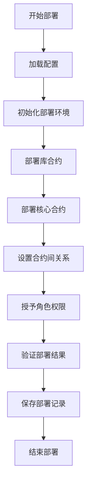

# 任务代号：XG0001 - 合约部署优化方案

## 背景

当前系统有多种部署方案，需要整合和优化以提高部署效率、降低出错概率，并确保适用于各种网络环境。

## 现有部署脚本分析

目前系统中存在三种主要部署脚本：

1. **deploy-basic.js**: 基础部署脚本，直接部署不可升级合约
2. **deploy-standard.js**: 标准部署脚本，使用OpenZeppelin upgrades插件部署UUPS可升级代理
3. **deploy-unified.js**: 统一部署入口，支持所有网络部署，包含错误处理和日志记录功能

## 优化部署方案

### 方案设计

我们将整合现有脚本的优点，形成一个统一、健壮、可配置的部署方案：

#### 1. 分层架构设计

```
部署流程
  ├── 配置层 (config/)
  │   ├── 网络配置
  │   └── 合约参数配置
  ├── 核心层 (core/)
  │   ├── 部署工具库
  │   ├── 交易处理器
  │   └── 日志记录器
  └── 实现层 (implementations/)
      ├── 基础部署 (direct)
      ├── 可升级部署 (upgradeable)
      └── 验证部署 (verify)
```

#### 2. 统一部署接口

创建一个统一的部署接口，根据配置自动选择合适的部署策略。

#### 3. 错误处理和恢复机制

- 自动重试机制
- 部署状态持久化
- 断点续传功能
- 详细日志记录

#### 4. 部署后验证

- 自动验证合约代码
- 合约地址和关系检查
- 角色权限检查

### 实现详情

#### 1. 部署配置模块

创建了统一的部署配置模块 `shared/config/deployment.js`，提供了：

- 部署策略枚举（直接部署、可升级部署、最小化部署）
- 默认部署配置（合约顺序、库依赖、初始化参数等）
- 配置加载与验证功能
- 深度合并配置对象的工具函数

配置示例：

```javascript
// 默认部署配置
const defaultDeploymentConfig = {
  // 部署策略
  strategy: DeploymentStrategy.UPGRADEABLE,
  
  // 合约部署顺序
  deploymentOrder: [
    'RoleManager',
    'FeeManager',
    'PropertyRegistry',
    // ...其他合约
  ],
  
  // 库合约
  libraries: [
    'SystemDeployerLib1',
    'SystemDeployerLib2'
  ],
  
  // 合约初始化参数
  initializeParams: {
    RoleManager: () => [],
    FeeManager: (contracts) => [contracts.RoleManager],
    // ...其他合约初始化参数
  },
  
  // 部署选项
  options: {
    // ...各种选项配置
  }
};
```

#### 2. 部署执行器

实现了通用部署执行器 `shared/utils/deployer.js`，包含：

- 多策略支持（直接部署、可升级部署、最小化部署）
- 库合约部署功能
- 智能重试机制
- 自动角色授权
- 部署记录保存

部署执行器示例：

```javascript
// 可升级部署方法实现
async deployUpgradeableContract(contractName) {
  logger.info(`部署可升级合约 ${contractName}...`);
  
  // 准备合约工厂
  const factory = await this.prepareContractFactory(contractName);
  
  // 获取初始化参数
  const initParams = this.getInitializeParams(contractName);
  
  // 添加重试逻辑
  let retries = 0;
  
  while (retries <= this.config.options.retry.maxRetries) {
    try {
      // 部署可升级合约 (使用UUPS模式)
      const proxy = await upgrades.deployProxy(
        factory, 
        initParams, 
        { 
          kind: 'uups',
          initializer: 'initialize',
          unsafeAllow: ['constructor', 'delegatecall']
        }
      );
      
      // 等待部署确认
      await proxy.waitForDeployment();
      
      // 保存部署结果
      const proxyAddress = await proxy.getAddress();
      this.deployedContracts[contractName] = proxyAddress;
      
      return { 
        proxy, 
        implementation: await upgrades.erc1967.getImplementationAddress(proxyAddress) 
      };
    } catch (error) {
      // 重试逻辑
      // ...
    }
  }
}
```

#### 3. 统一部署入口

创建了新的部署入口脚本 `scripts/deploy.js`，支持：

- 命令行参数解析
- 多策略选择
- 空运行模式
- 部署状态记录

示例用法：

```bash
# 使用可升级策略部署到BSC测试网
npx hardhat run scripts/deploy.js --network bsc_testnet --strategy=upgradeable

# 执行空运行部署
npx hardhat run scripts/deploy.js --network bsc_testnet --dry-run
```

#### 4. 网络部署脚本

改进了网络部署Shell脚本 `scripts/deploy-network.sh`，提供：

- 命令行参数解析
- 多网络支持
- 部署选项控制
- 主网确认机制
- 彩色输出

示例用法：

```bash
# 部署到BSC测试网
./scripts/deploy-network.sh bsc_testnet

# 使用直接部署策略并验证合约
./scripts/deploy-network.sh bsc_testnet --strategy=direct --verify
```

#### 5. 部署测试脚本

创建了部署验证测试脚本 `scripts/test/deployment-test.js`，用于：

- 验证合约是否正确部署
- 检查角色权限设置
- 验证合约关联关系
- 生成测试报告

### 部署流程



## 使用说明

### 1. 基本用法

使用统一部署入口：

```bash
# 使用默认配置部署到Hardhat网络
npx hardhat run scripts/deploy.js

# 部署到特定网络
npx hardhat run scripts/deploy.js --network bsc_testnet
```

使用网络部署脚本：

```bash
# 部署到BSC测试网
./scripts/deploy-network.sh bsc_testnet

# 查看帮助
./scripts/deploy-network.sh --help
```

### 2. 选择部署策略

可以选择以下部署策略：

- `direct`: 直接部署（不可升级）
- `upgradeable`: 可升级部署（UUPS代理，默认）
- `minimal`: 最小化部署（测试用）

```bash
# 使用直接部署策略
./scripts/deploy-network.sh hardhat --strategy=direct
```

### 3. 使用空运行模式

空运行模式不会实际部署合约，用于测试部署流程：

```bash
# 空运行部署
./scripts/deploy-network.sh bsc_testnet --dry-run
```

### 4. 验证部署结果

部署后验证合约：

```bash
# 部署并验证
./scripts/deploy-network.sh bsc_testnet --verify

# 单独验证
npx hardhat run scripts/verify-contracts.js --network bsc_testnet
```

测试部署结果：

```bash
# 运行部署测试
npx hardhat run scripts/test/deployment-test.js --network bsc_testnet
```

## 预期效果

1. **提高部署效率**: 自动化部署流程，减少手动操作
2. **增强稳定性**: 完善的错误处理和恢复机制
3. **简化维护**: 统一的接口和配置简化后续维护
4. **提高安全性**: 自动验证部署结果，确保系统正确部署

## 关键设计决策

1. **可升级性优先**: 默认使用UUPS代理模式确保合约可升级
2. **配置驱动设计**: 通过配置控制部署行为，避免硬编码
3. **失败安全机制**: 完整的错误处理确保部署过程可预测和可恢复 