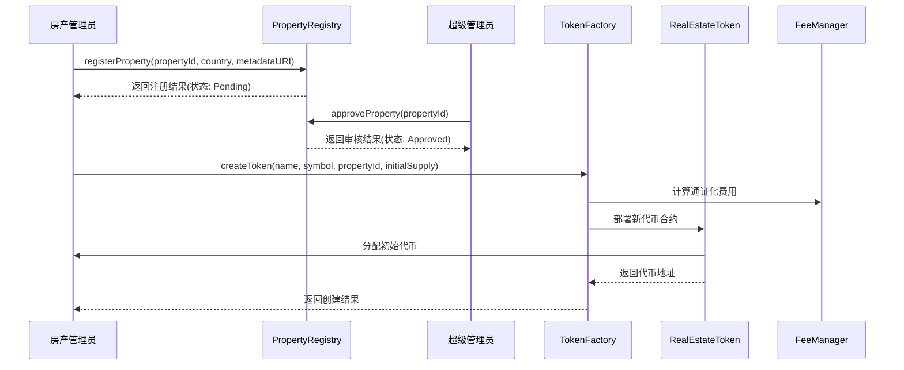
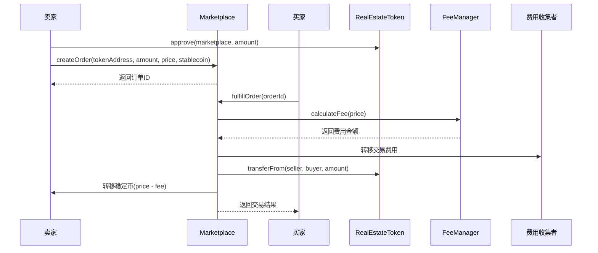
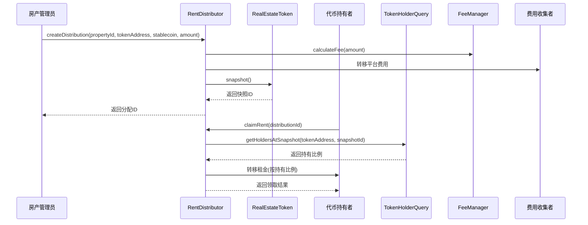
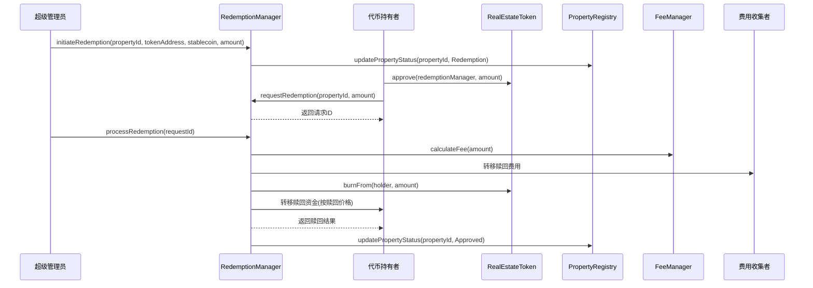
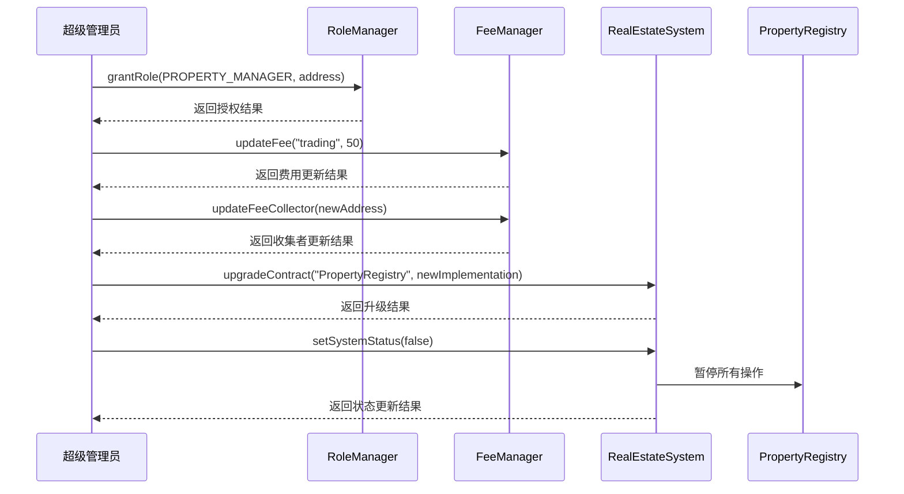
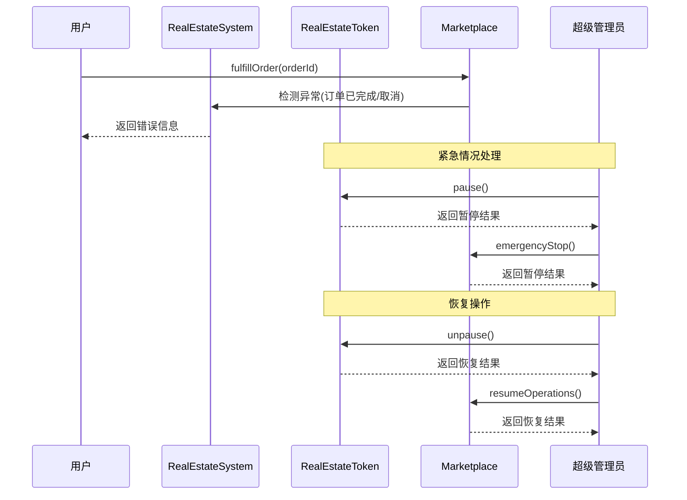
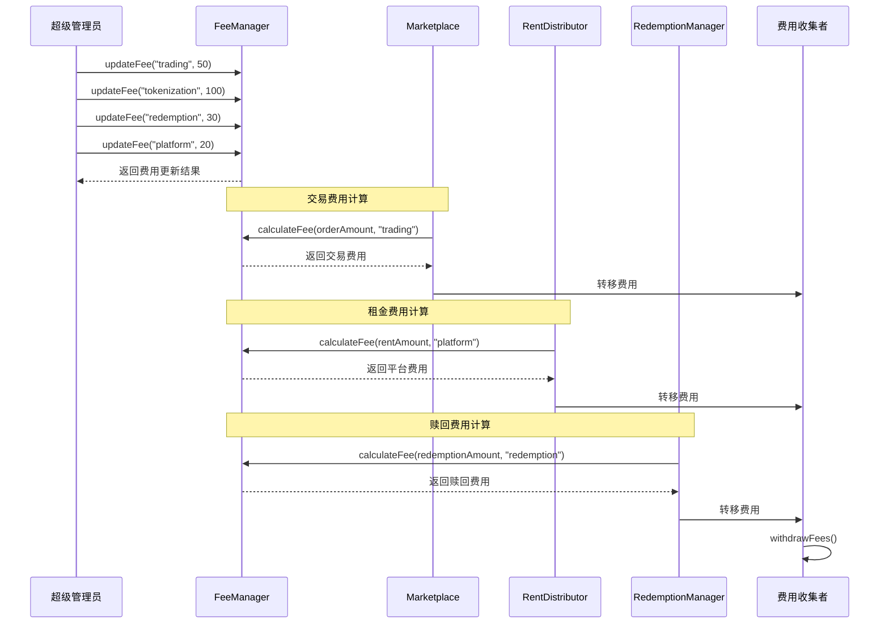
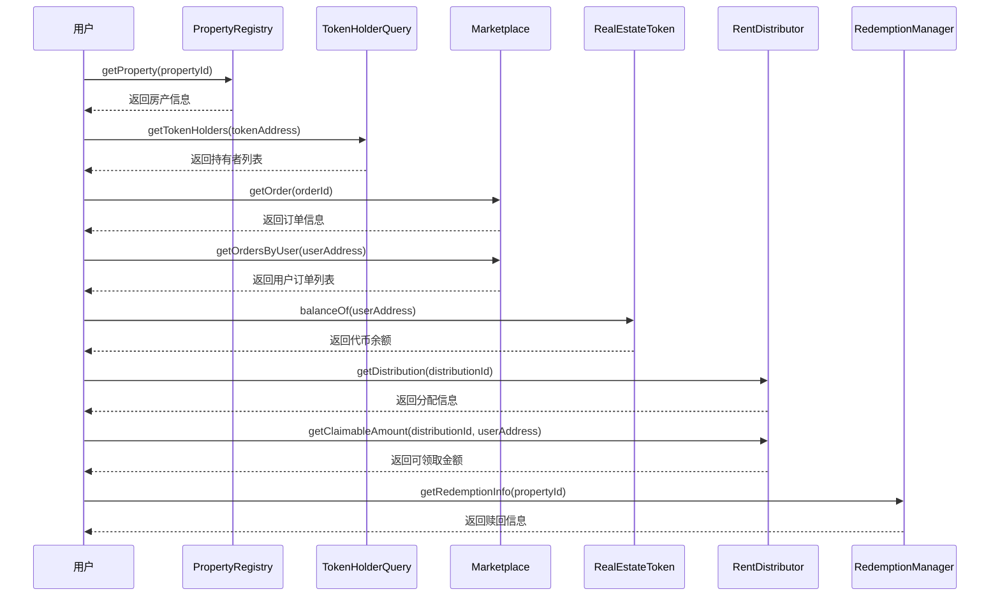
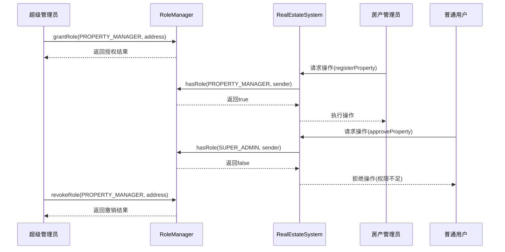
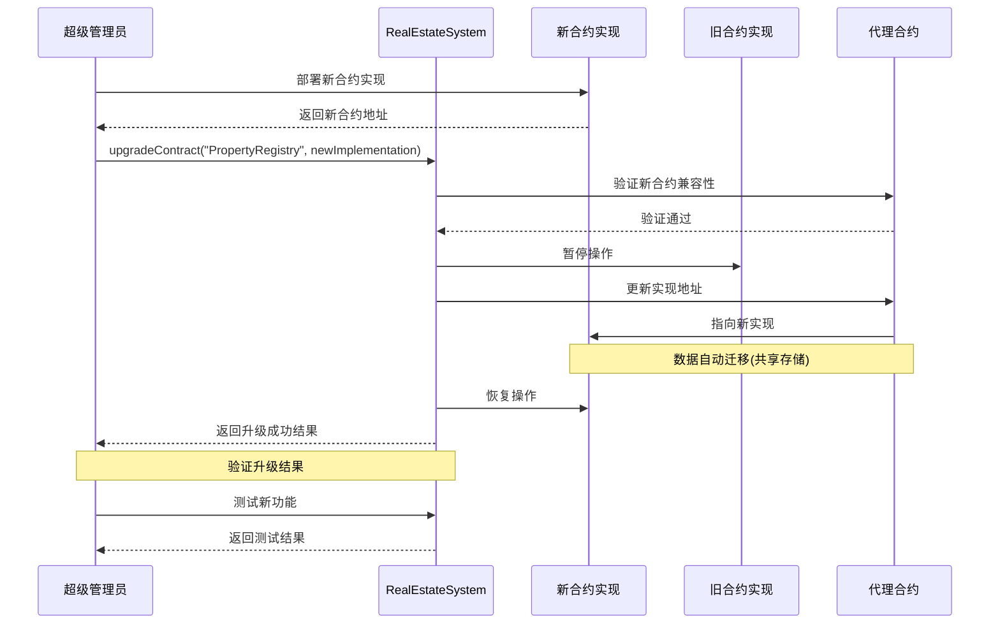

# 日本房产通证化系统流程图

## 1. 房产注册与通证化流程

```mermaid
sequenceDiagram
    participant PM as 房产管理员
    participant PR as PropertyRegistry
    participant SA as 超级管理员
    participant TF as TokenFactory
    participant RT as RealEstateToken
    participant FM as FeeManager

    PM->>PR: registerProperty(propertyId, country, metadataURI)
    PR-->>PM: 返回注册结果(状态: Pending)
    SA->>PR: approveProperty(propertyId)
    PR-->>SA: 返回审核结果(状态: Approved)
    PM->>TF: createToken(name, symbol, propertyId, initialSupply)
    TF->>FM: 计算通证化费用
    TF->>RT: 部署新代币合约
    RT->>PM: 分配初始代币
    RT-->>TF: 返回代币地址
    TF-->>PM: 返回创建结果
```

## 2. 二级市场交易流程

```mermaid
sequenceDiagram
    participant S as 卖家
    participant M as Marketplace
    participant B as 买家
    participant RT as RealEstateToken
    participant FM as FeeManager
    participant FC as 费用收集者

    S->>RT: approve(marketplace, amount)
    S->>M: createOrder(tokenAddress, amount, price, stablecoin)
    M-->>S: 返回订单ID
    B->>M: fulfillOrder(orderId)
    M->>FM: calculateFee(price)
    FM-->>M: 返回费用金额
    M->>FC: 转移交易费用
    M->>RT: transferFrom(seller, buyer, amount)
    M->>S: 转移稳定币(price - fee)
    M-->>B: 返回交易结果
```

## 3. 租金分配流程

```mermaid
sequenceDiagram
    participant PM as 房产管理员
    participant RD as RentDistributor
    participant RT as RealEstateToken
    participant H as 代币持有者
    participant THQ as TokenHolderQuery
    participant FM as FeeManager
    participant FC as 费用收集者

    PM->>RD: createDistribution(propertyId, tokenAddress, stablecoin, amount)
    RD->>FM: calculateFee(amount)
    RD->>FC: 转移平台费用
    RD->>RT: snapshot()
    RT-->>RD: 返回快照ID
    RD-->>PM: 返回分配ID
    H->>RD: claimRent(distributionId)
    RD->>THQ: getHoldersAtSnapshot(tokenAddress, snapshotId)
    THQ-->>RD: 返回持有比例
    RD->>H: 转移租金(按持有比例)
    RD-->>H: 返回领取结果
```

## 4. 赎回流程

```mermaid
sequenceDiagram
    participant SA as 超级管理员
    participant RM as RedemptionManager
    participant H as 代币持有者
    participant RT as RealEstateToken
    participant PR as PropertyRegistry
    participant FM as FeeManager
    participant FC as 费用收集者

    SA->>RM: initiateRedemption(propertyId, tokenAddress, stablecoin, amount)
    RM->>PR: updatePropertyStatus(propertyId, Redemption)
    H->>RT: approve(redemptionManager, amount)
    H->>RM: requestRedemption(propertyId, amount)
    RM-->>H: 返回请求ID
    SA->>RM: processRedemption(requestId)
    RM->>FM: calculateFee(amount)
    RM->>FC: 转移赎回费用
    RM->>RT: burnFrom(holder, amount)
    RM->>H: 转移赎回资金(按赎回价格)
    RM-->>H: 返回赎回结果
    RM->>PR: updatePropertyStatus(propertyId, Approved)
```

## 5. 系统管理流程

```mermaid
sequenceDiagram
    participant SA as 超级管理员
    participant RoM as RoleManager
    participant FM as FeeManager
    participant RS as RealEstateSystem
    participant PR as PropertyRegistry

    SA->>RoM: grantRole(PROPERTY_MANAGER, address)
    RoM-->>SA: 返回授权结果
    SA->>FM: updateFee("trading", 50)
    FM-->>SA: 返回费用更新结果
    SA->>FM: updateFeeCollector(newAddress)
    FM-->>SA: 返回收集者更新结果
    SA->>RS: upgradeContract("PropertyRegistry", newImplementation)
    RS-->>SA: 返回升级结果
    SA->>RS: setSystemStatus(false)
    RS->>PR: 暂停所有操作
    RS-->>SA: 返回状态更新结果
```

## 6. 异常处理流程

```mermaid
sequenceDiagram
    participant U as 用户
    participant RS as RealEstateSystem
    participant RT as RealEstateToken
    participant M as Marketplace
    participant SA as 超级管理员

    U->>M: fulfillOrder(orderId)
    M->>RS: 检测异常(订单已完成/取消)
    RS-->>U: 返回错误信息
    
    Note over SA,RT: 紧急情况处理
    SA->>RT: pause()
    RT-->>SA: 返回暂停结果
    SA->>M: emergencyStop()
    M-->>SA: 返回暂停结果
    
    Note over SA,RT: 恢复操作
    SA->>RT: unpause()
    RT-->>SA: 返回恢复结果
    SA->>M: resumeOperations()
    M-->>SA: 返回恢复结果
```

## 7. 费用管理流程

```mermaid
sequenceDiagram
    participant SA as 超级管理员
    participant FM as FeeManager
    participant M as Marketplace
    participant RD as RentDistributor
    participant RM as RedemptionManager
    participant FC as 费用收集者

    SA->>FM: updateFee("trading", 50)
    SA->>FM: updateFee("tokenization", 100)
    SA->>FM: updateFee("redemption", 30)
    SA->>FM: updateFee("platform", 20)
    FM-->>SA: 返回费用更新结果
    
    Note over M,FM: 交易费用计算
    M->>FM: calculateFee(orderAmount, "trading")
    FM-->>M: 返回交易费用
    M->>FC: 转移费用
    
    Note over RD,FM: 租金费用计算
    RD->>FM: calculateFee(rentAmount, "platform")
    FM-->>RD: 返回平台费用
    RD->>FC: 转移费用
    
    Note over RM,FM: 赎回费用计算
    RM->>FM: calculateFee(redemptionAmount, "redemption")
    FM-->>RM: 返回赎回费用
    RM->>FC: 转移费用
    
    FC->>FC: withdrawFees()
```

## 8. 数据查询流程

```mermaid
sequenceDiagram
    participant U as 用户
    participant PR as PropertyRegistry
    participant THQ as TokenHolderQuery
    participant M as Marketplace
    participant RT as RealEstateToken
    participant RD as RentDistributor
    participant RM as RedemptionManager

    U->>PR: getProperty(propertyId)
    PR-->>U: 返回房产信息
    
    U->>THQ: getTokenHolders(tokenAddress)
    THQ-->>U: 返回持有者列表
    
    U->>M: getOrder(orderId)
    M-->>U: 返回订单信息
    
    U->>M: getOrdersByUser(userAddress)
    M-->>U: 返回用户订单列表
    
    U->>RT: balanceOf(userAddress)
    RT-->>U: 返回代币余额
    
    U->>RD: getDistribution(distributionId)
    RD-->>U: 返回分配信息
    
    U->>RD: getClaimableAmount(distributionId, userAddress)
    RD-->>U: 返回可领取金额
    
    U->>RM: getRedemptionInfo(propertyId)
    RM-->>U: 返回赎回信息
```

## 9. 权限控制流程

```mermaid
sequenceDiagram
    participant SA as 超级管理员
    participant RoM as RoleManager
    participant RS as RealEstateSystem
    participant PM as 房产管理员
    participant U as 普通用户

    SA->>RoM: grantRole(PROPERTY_MANAGER, address)
    RoM-->>SA: 返回授权结果
    
    PM->>RS: 请求操作(registerProperty)
    RS->>RoM: hasRole(PROPERTY_MANAGER, sender)
    RoM-->>RS: 返回true
    RS-->>PM: 执行操作
    
    U->>RS: 请求操作(approveProperty)
    RS->>RoM: hasRole(SUPER_ADMIN, sender)
    RoM-->>RS: 返回false
    RS-->>U: 拒绝操作(权限不足)
    
    SA->>RoM: revokeRole(PROPERTY_MANAGER, address)
    RoM-->>SA: 返回撤销结果
```

## 10. 系统升级流程

```mermaid
sequenceDiagram
    participant SA as 超级管理员
    participant RS as RealEstateSystem
    participant NC as 新合约实现
    participant OC as 旧合约实现
    participant P as 代理合约

    SA->>NC: 部署新合约实现
    NC-->>SA: 返回新合约地址
    
    SA->>RS: upgradeContract("PropertyRegistry", newImplementation)
    RS->>P: 验证新合约兼容性
    P-->>RS: 验证通过
    
    RS->>OC: 暂停操作
    RS->>P: 更新实现地址
    P->>NC: 指向新实现
    
    Note over P,NC: 数据自动迁移(共享存储)
    
    RS->>NC: 恢复操作
    RS-->>SA: 返回升级成功结果
    
    Note over SA,RS: 验证升级结果
    SA->>RS: 测试新功能
    RS-->>SA: 返回测试结果
``` 