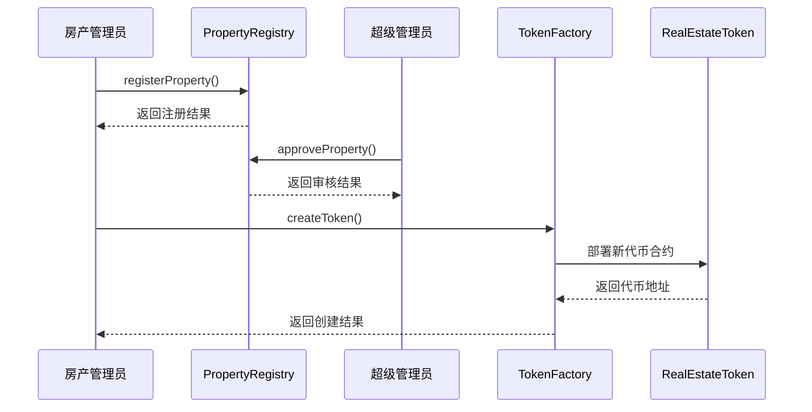
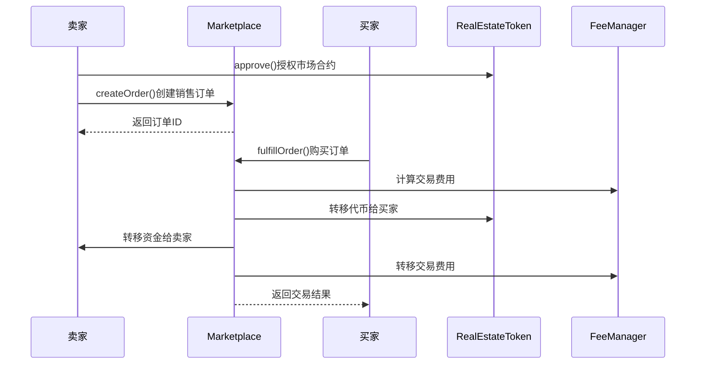
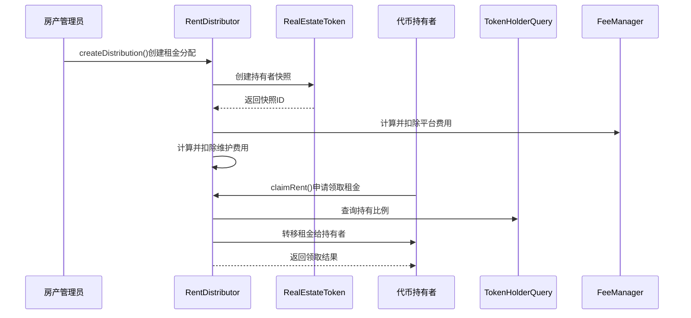
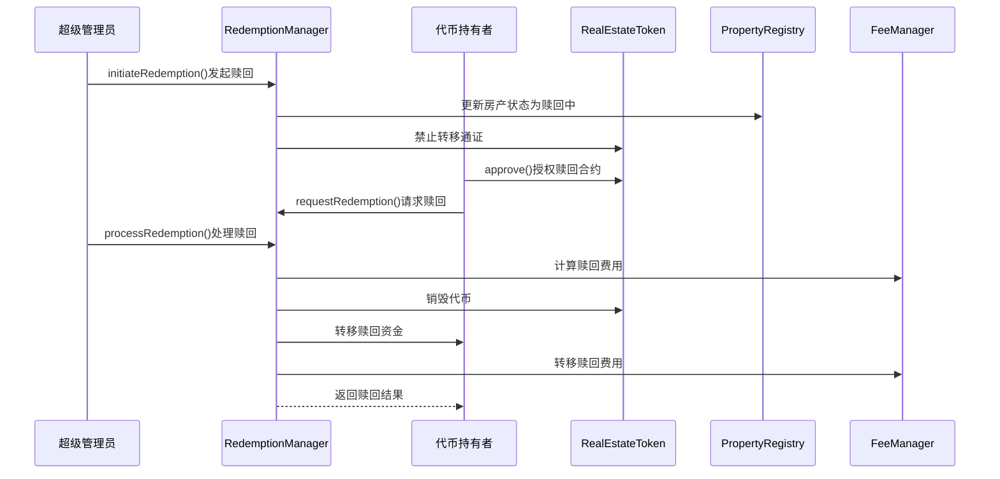
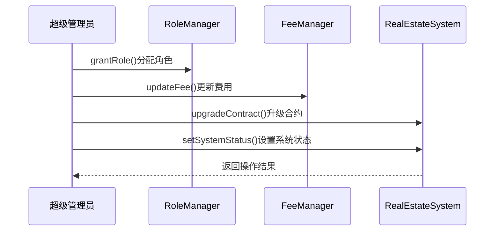
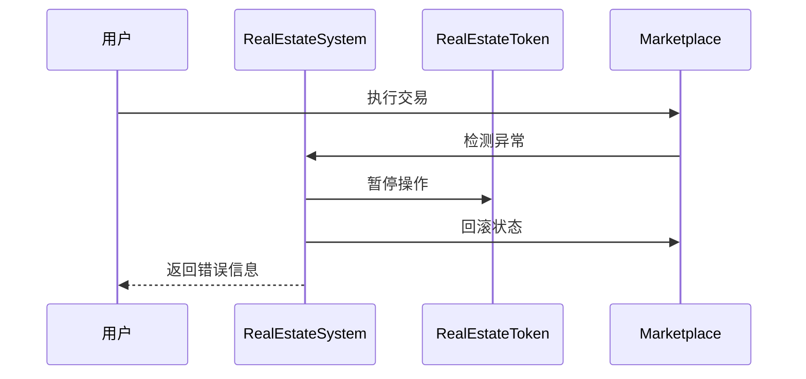
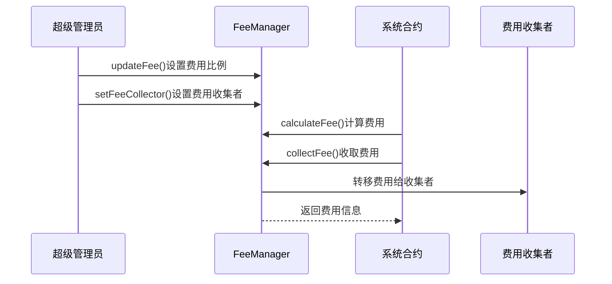
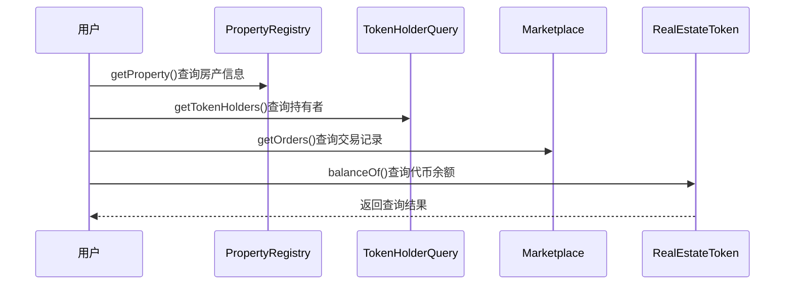
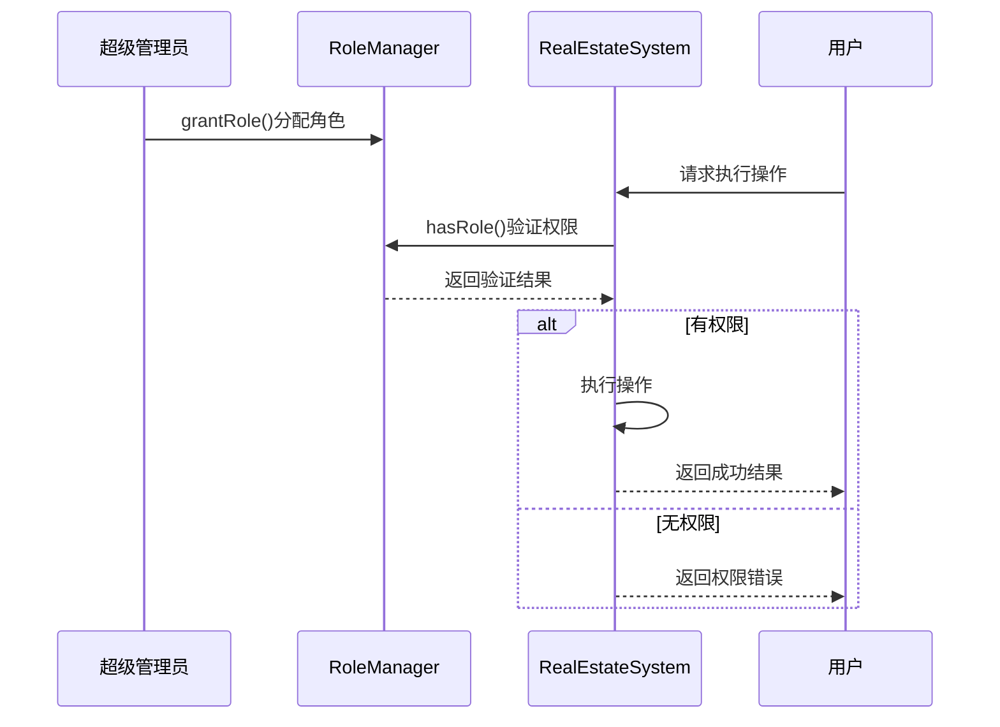
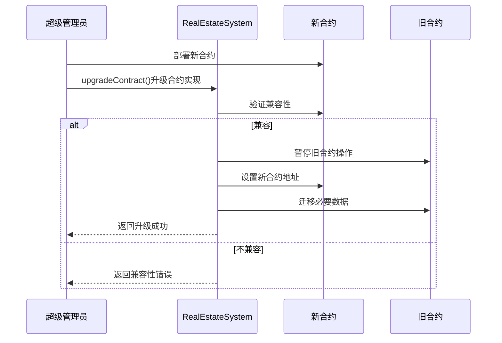

# 日本房产通证化系统流程图

本文档包含日本房产通证化系统各主要业务流程的详细流程图，帮助开发者和用户理解系统运作机制。

## 1. 房产注册与通证化流程

该流程描述了从房产注册到通证创建的完整过程：

## 2. 二级市场交易流程

该流程描述了通证在二级市场的交易过程：

## 3. 租金分配流程

该流程描述了租金如何分配给通证持有者：

## 4. 赎回流程

该流程描述了通证赎回的完整过程：

## 5. 系统管理流程

该流程描述了系统管理员如何管理系统：

## 6. 异常处理流程

该流程描述了系统如何处理异常情况：

## 7. 费用管理流程

该流程描述了系统费用的管理和收取：

## 8. 数据查询流程

该流程描述了用户如何查询系统数据：

## 9. 权限控制流程

该流程描述了系统如何控制权限：

## 10. 系统升级流程

该流程描述了系统如何进行升级：

