# 日本房产通证化系统角色功能表

本文档详细描述了日本房产通证化系统中各角色的功能权限，方便开发者和管理员了解系统权限结构。

## 1. 角色定义

系统定义了以下几种角色：

1. **超级管理员(SUPER_ADMIN)**: 拥有系统最高权限，负责整个系统的管理和控制
2. **房产管理员(PROPERTY_MANAGER)**: 负责房产注册、审核、通证创建和租金分配
3. **代币持有者(TOKEN_HOLDER)**: 通证持有者，可以交易通证、领取租金、参与赎回
4. **普通用户(USER)**: 未持有通证的用户，可以查询信息、购买通证
5. **费用收集者(FEE_COLLECTOR)**: 负责收集系统产生的各种费用

## 2. 角色功能图

```mermaid
graph TB
    %% 角色定义
    SuperAdmin[超级管理员]
    PropertyManager[房产管理员]
    TokenHolder[代币持有者]
    User[普通用户]
    FeeCollector[费用收集者]

    %% 超级管理员功能
    SuperAdmin --> SystemManage[系统管理]
    SuperAdmin --> RoleManage[角色管理]
    SuperAdmin --> FeeManage[费用管理]
    SuperAdmin --> PropertyApprove[房产审核]
    SuperAdmin --> RedemptionManage[赎回管理]
    SuperAdmin --> EmergencyControl[紧急控制]

    %% 房产管理员功能
    PropertyManager --> PropertyRegister[房产注册]
    PropertyManager --> TokenCreate[代币创建]
    PropertyManager --> RentDistribute[租金分配]
    PropertyManager --> PropertyUpdate[房产信息更新]

    %% 代币持有者功能
    TokenHolder --> TokenTrade[代币交易]
    TokenHolder --> RentClaim[租金领取]
    TokenHolder --> RedemptionRequest[赎回申请]
    TokenHolder --> TokenQuery[代币查询]

    %% 普通用户功能
    User --> MarketQuery[市场查询]
    User --> PropertyQuery[房产查询]
    User --> TokenBuy[代币购买]

    %% 费用收集者功能
    FeeCollector --> FeeWithdraw[费用提取]
    FeeCollector --> FeeQuery[费用查询]

    %% 样式定义
    classDef roleStyle fill:#f9f,stroke:#333,stroke-width:2px
    classDef functionStyle fill:#bbf,stroke:#333,stroke-width:1px
    
    class SuperAdmin,PropertyManager,TokenHolder,User,FeeCollector roleStyle
    class SystemManage,RoleManage,FeeManage,PropertyApprove,RedemptionManage,EmergencyControl,PropertyRegister,TokenCreate,RentDistribute,PropertyUpdate,TokenTrade,RentClaim,RedemptionRequest,TokenQuery,MarketQuery,PropertyQuery,TokenBuy,FeeWithdraw,FeeQuery functionStyle
```



## 3. 角色功能详细说明

### 3.1 超级管理员

1. **系统管理**
   - 设置系统状态（活跃/暂停）
   - 升级系统合约
   - 管理系统参数和配置

2. **角色管理**
   - 分配角色权限给特定地址
   - 撤销地址的角色权限
   - 查看系统角色列表和分配情况

3. **费用管理**
   - 设置通证化费用比例
   - 设置交易费用比例
   - 设置赎回费用比例
   - 设置平台费用比例
   - 设置维护费用比例
   - 更新费用收集地址

4. **房产审核**
   - 审核房产注册申请
   - 拒绝不合规的房产注册
   - 查看待审核房产列表

5. **赎回管理**
   - 发起房产通证赎回流程
   - 处理用户的赎回请求
   - 管理赎回期限和赎回资金

6. **紧急控制**
   - 在紧急情况下暂停系统
   - 恢复系统运行
   - 紧急冻结特定合约或功能

### 3.2 房产管理员

1. **房产注册**
   - 提交新房产的详细信息
   - 上传房产相关文件和证明
   - 管理已注册房产的状态

2. **代币创建**
   - 为已审核的房产创建通证
   - 设置通证的名称、符号等参数
   - 设置初始通证分配方案

3. **租金分配**
   - 创建新的租金分配
   - 设置租金总额和分配周期
   - 设置平台费用和维护费用金额
   - 监控租金分配进度和状态

4. **房产信息更新**
   - 更新房产的基本信息
   - 更新房产的状态和描述
   - 维护房产的元数据和附加信息

### 3.3 代币持有者

1. **代币交易**
   - 在二级市场创建销售订单
   - 购买其他持有者的通证
   - 取消未成交的订单
   - 查看自己的交易历史

2. **租金领取**
   - 查看可领取的租金分配
   - 领取租金
   - 查看历史租金领取记录

3. **赎回申请**
   - 在赎回期内申请通证赎回
   - 查看赎回申请的状态和进度
   - 确认赎回交易完成

4. **代币查询**
   - 查看自己的通证余额
   - 查看通证相关的房产信息
   - 查看交易历史和价格变动

### 3.4 普通用户

1. **市场查询**
   - 查看二级市场的交易情况
   - 查看可购买的通证订单列表
   - 查看市场价格和交易量信息

2. **房产查询**
   - 查看所有可用房产列表
   - 查看房产的详细信息
   - 查看房产对应的通证情况

3. **代币购买**
   - 在二级市场购买通证
   - 查看订单状态和交易进度
   - 确认交易完成并接收通证

### 3.5 费用收集者

1. **费用提取**
   - 提取系统收取的各类费用
   - 查看可提取的费用金额
   - 确认费用提取交易

2. **费用查询**
   - 查看各类费用的统计信息
   - 查看费用收取的明细记录
   - 查看历史提取记录

## 4. 权限矩阵

下表展示了各角色对应的功能权限：

| 功能模块 | 超级管理员 | 房产管理员 | 代币持有者 | 普通用户 | 费用收集者 |
|---------|-----------|------------|-----------|----------|------------|
| 系统管理 | ✓ | - | - | - | - |
| 角色管理 | ✓ | - | - | - | - |
| 费用管理 | ✓ | - | - | - | - |
| 房产审核 | ✓ | - | - | - | - |
| 赎回管理 | ✓ | - | - | - | - |
| 紧急控制 | ✓ | - | - | - | - |
| 房产注册 | - | ✓ | - | - | - |
| 代币创建 | - | ✓ | - | - | - |
| 租金分配 | - | ✓ | - | - | - |
| 房产更新 | - | ✓ | - | - | - |
| 代币交易(卖) | - | - | ✓ | - | - |
| 代币交易(买) | - | - | ✓ | ✓ | - |
| 租金领取 | - | - | ✓ | - | - |
| 赎回申请 | - | - | ✓ | - | - |
| 代币查询 | ✓ | ✓ | ✓ | ✓ | - |
| 市场查询 | ✓ | ✓ | ✓ | ✓ | - |
| 房产查询 | ✓ | ✓ | ✓ | ✓ | - |
| 费用提取 | - | - | - | - | ✓ |
| 费用查询 | ✓ | - | - | - | ✓ |

## 5. 合约与角色映射关系

下表展示了系统中各合约对应的角色权限需求：

| 合约名称 | 超级管理员 | 房产管理员 | 代币持有者 | 普通用户 | 费用收集者 |
|---------|-----------|------------|-----------|----------|------------|
| RoleManager | 管理角色 | - | - | - | - |
| PropertyRegistry | 审核房产 | 注册房产 | 查询房产 | 查询房产 | - |
| TokenFactory | 管理参数 | 创建通证 | - | - | - |
| RealEstateToken | 管理参数 | - | 交易通证 | - | - |
| Marketplace | 管理参数 | - | 创建/取消订单 | 购买通证 | - |
| RentDistributor | 管理参数 | 创建分配 | 领取租金 | - | - |
| RedemptionManager | 发起/处理赎回 | - | 请求赎回 | - | - |
| FeeManager | 设置费用 | - | - | - | 提取费用 |
| TokenHolderQuery | - | - | 查询持有 | 查询持有 | - |
| RealEstateSystem | 系统管理 | - | - | - | - |
``` 