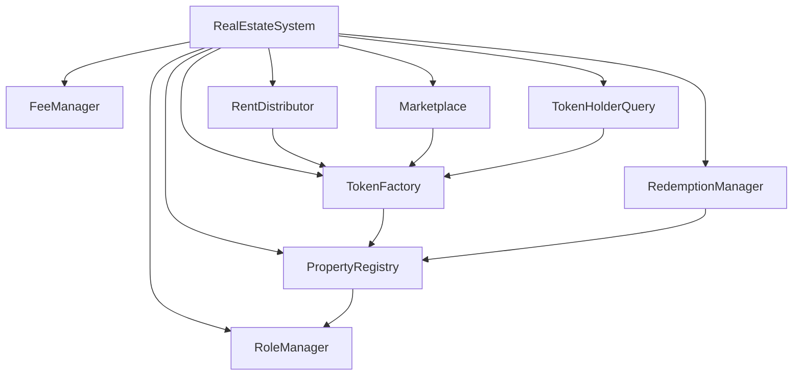

# 日本房产通证化系统部署文档

## 1. 部署环境准备

### 1.1 环境要求
- Node.js >= 16.0.0
- Hardhat >= 2.14.0
- OpenZeppelin Contracts >= 4.8.0
- Ethers.js >= 5.7.0

### 1.2 网络配置
```javascript
networks: {
    mainnet: {
        url: process.env.MAINNET_RPC_URL,
        accounts: [process.env.PRIVATE_KEY],
        chainId: 1
    },
    testnet: {
        url: process.env.TESTNET_RPC_URL,
        accounts: [process.env.PRIVATE_KEY],
        chainId: 5
    }
}
```

## 2. 合约部署顺序

### 2.1 核心合约部署顺序
1. RealEstateSystem
2. RoleManager
3. FeeManager
4. PropertyRegistry
5. TokenFactory
6. RedemptionManager
7. RentDistributor
8. Marketplace
9. TokenHolderQuery

### 2.2 依赖关系


## 3. 部署步骤

### 3.1 部署命令
```bash
# 1. 部署 RealEstateSystem
npx hardhat run scripts/deploy/01_deploy_system.js --network mainnet

# 2. 部署其他核心合约
npx hardhat run scripts/deploy/02_deploy_core.js --network mainnet

# 3. 初始化系统
npx hardhat run scripts/deploy/03_initialize_system.js --network mainnet
```

### 3.2 合约初始化
```solidity
// 1. 初始化 RealEstateSystem
function initialize() external initializer {
    __Ownable_init();
    systemActive = true;
}

// 2. 设置合约地址
function setSystemContracts(
    address roleManager,
    address feeManager,
    address propertyRegistry,
    address tokenFactory,
    address redemptionManager,
    address rentDistributor,
    address marketplace,
    address tokenHolderQuery
) external onlyOwner
```

## 4. 角色配置

### 4.1 必要角色设置
```javascript
// 1. 设置超级管理员
await roleManager.grantRole(SUPER_ADMIN_ROLE, superAdminAddress);

// 2. 设置房产管理员
await roleManager.grantRole(PROPERTY_MANAGER_ROLE, propertyManagerAddress);

// 3. 设置费用收集者
await roleManager.grantRole(FEE_COLLECTOR_ROLE, feeCollectorAddress);
```

### 4.2 权限验证
```javascript
// 验证角色设置
const isSuperAdmin = await roleManager.hasRole(SUPER_ADMIN_ROLE, superAdminAddress);
const isPropertyManager = await roleManager.hasRole(PROPERTY_MANAGER_ROLE, propertyManagerAddress);
const isFeeCollector = await roleManager.hasRole(FEE_COLLECTOR_ROLE, feeCollectorAddress);
```

## 5. 系统参数配置

### 5.1 费用设置
```javascript
// 设置各类费用比例
await feeManager.updateFee("trading", 50);      // 0.5%
await feeManager.updateFee("tokenization", 100); // 1%
await feeManager.updateFee("redemption", 30);    // 0.3%
await feeManager.updateFee("platform", 20);      // 0.2%
```

### 5.2 系统状态设置
```javascript
// 激活系统
await realEstateSystem.setSystemStatus(true);
```

## 6. 验证步骤

### 6.1 合约验证
```bash
# 验证 RealEstateSystem 合约
npx hardhat verify --network mainnet REAL_ESTATE_SYSTEM_ADDRESS

# 验证其他合约
npx hardhat verify --network mainnet CONTRACT_ADDRESS CONSTRUCTOR_ARGS
```

### 6.2 功能测试
1. 房产注册测试
2. 代币创建测试
3. 交易功能测试
4. 租金分配测试
5. 赎回功能测试

## 7. 安全检查清单

### 7.1 部署前检查
- [ ] 合约代码已经过审计
- [ ] 测试网络部署测试通过
- [ ] 所有依赖库版本正确
- [ ] 环境变量配置正确

### 7.2 部署后检查
- [ ] 所有合约地址正确设置
- [ ] 角色权限正确分配
- [ ] 系统参数正确配置
- [ ] 紧急暂停功能测试通过

## 8. 维护说明

### 8.1 合约升级
```javascript
// 升级系统合约
await realEstateSystem.upgradeContract(
    "PropertyRegistry",
    newImplementationAddress
);
```

### 8.2 日常维护
1. 定期检查系统状态
2. 监控交易活动
3. 更新系统参数
4. 处理异常情况

## 9. 紧急预案

### 9.1 系统暂停
```javascript
// 紧急情况下暂停系统
await realEstateSystem.setSystemStatus(false);
```

### 9.2 恢复操作
1. 问题排查
2. 修复漏洞
3. 系统恢复
4. 状态验证

## 10. 部署记录模板

```plaintext
部署日期：YYYY-MM-DD
网络：[主网/测试网]
部署人：[姓名]

合约地址：
- RealEstateSystem: 0x...
- RoleManager: 0x...
- FeeManager: 0x...
- PropertyRegistry: 0x...
- TokenFactory: 0x...
- RedemptionManager: 0x...
- RentDistributor: 0x...
- Marketplace: 0x...
- TokenHolderQuery: 0x...

初始配置：
- 超级管理员：0x...
- 房产管理员：0x...
- 费用收集者：0x...

系统参数：
- 交易费率：0.5%
- 通证化费率：1%
- 赎回费率：0.3%
- 平台费率：0.2%

验证状态：
- 合约验证：完成/未完成
- 功能测试：通过/未通过
- 安全检查：通过/未通过

备注：
[记录特殊情况和注意事项] 