# 日本房产通证化系统角色功能

## 1. 角色功能图

```mermaid
graph TB
    %% 角色定义
    SuperAdmin[超级管理员]
    PropertyManager[房产管理员]
    TokenHolder[代币持有者]
    User[普通用户]
    FeeCollector[费用收集者]

    %% 超级管理员功能
    SuperAdmin --> SystemManage[系统管理]
    SuperAdmin --> RoleManage[角色管理]
    SuperAdmin --> FeeManage[费用管理]
    SuperAdmin --> PropertyApprove[房产审核]
    SuperAdmin --> RedemptionManage[赎回管理]
    SuperAdmin --> EmergencyControl[紧急控制]

    %% 房产管理员功能
    PropertyManager --> PropertyRegister[房产注册]
    PropertyManager --> TokenCreate[代币创建]
    PropertyManager --> RentDistribute[租金分配]
    PropertyManager --> PropertyUpdate[房产信息更新]

    %% 代币持有者功能
    TokenHolder --> TokenTrade[代币交易]
    TokenHolder --> RentClaim[租金领取]
    TokenHolder --> RedemptionRequest[赎回申请]
    TokenHolder --> TokenQuery[代币查询]

    %% 普通用户功能
    User --> MarketQuery[市场查询]
    User --> PropertyQuery[房产查询]
    User --> TokenBuy[代币购买]

    %% 费用收集者功能
    FeeCollector --> FeeWithdraw[费用提取]
    FeeCollector --> FeeQuery[费用查询]

    %% 样式定义
    classDef roleStyle fill:#f9f,stroke:#333,stroke-width:2px
    classDef functionStyle fill:#bbf,stroke:#333,stroke-width:1px
    
    class SuperAdmin,PropertyManager,TokenHolder,User,FeeCollector roleStyle
    class SystemManage,RoleManage,FeeManage,PropertyApprove,RedemptionManage,EmergencyControl,PropertyRegister,TokenCreate,RentDistribute,PropertyUpdate,TokenTrade,RentClaim,RedemptionRequest,TokenQuery,MarketQuery,PropertyQuery,TokenBuy,FeeWithdraw,FeeQuery functionStyle
```

## 2. 角色功能列表

### 2.1 超级管理员

1. 系统管理
   - 设置系统状态
   - 升级系统合约
   - 管理系统参数

2. 角色管理
   - 分配角色权限
   - 撤销角色权限
   - 查看角色列表

3. 费用管理
   - 设置费用比例
   - 更新费用收集地址
   - 管理费用类型

4. 房产审核
   - 审核房产注册
   - 拒绝房产注册
   - 查看待审核列表

5. 赎回管理
   - 发起赎回流程
   - 处理赎回请求
   - 管理赎回状态

6. 紧急控制
   - 暂停系统操作
   - 恢复系统操作
   - 紧急状态管理

### 2.2 房产管理员

1. 房产注册
   - 提交房产信息
   - 上传房产文档
   - 管理房产状态

2. 代币创建
   - 创建房产代币
   - 设置代币参数
   - 管理初始分配

3. 租金分配
   - 创建租金分配
   - 设置分配参数
   - 监控分配状态

4. 房产信息更新
   - 更新房产信息
   - 管理房产状态
   - 维护元数据

### 2.3 代币持有者

1. 代币交易
   - 创建销售订单
   - 购买代币
   - 取消订单

2. 租金领取
   - 查看可领取租金
   - 领取租金
   - 查看历史记录

3. 赎回申请
   - 申请代币赎回
   - 查看赎回状态
   - 确认赎回交易

4. 代币查询
   - 查看代币余额
   - 查看交易历史
   - 查看持仓详情

### 2.4 普通用户

1. 市场查询
   - 查看交易市场
   - 查看订单列表
   - 查看价格信息

2. 房产查询
   - 查看房产列表
   - 查看房产详情
   - 查看通证信息

3. 代币购买
   - 购买市场代币
   - 查看订单状态
   - 确认交易完成

### 2.5 费用收集者

1. 费用提取
   - 提取平台费用
   - 提取交易费用
   - 提取赎回费用

2. 费用查询
   - 查看费用统计
   - 查看费用明细
   - 查看历史记录

## 3. 权限矩阵

| 功能模块 | 超级管理员 | 房产管理员 | 代币持有者 | 普通用户 | 费用收集者 |
|---------|-----------|------------|-----------|----------|------------|
| 系统管理 | ✓ | - | - | - | - |
| 角色管理 | ✓ | - | - | - | - |
| 费用管理 | ✓ | - | - | - | - |
| 房产审核 | ✓ | - | - | - | - |
| 赎回管理 | ✓ | - | - | - | - |
| 紧急控制 | ✓ | - | - | - | - |
| 房产注册 | - | ✓ | - | - | - |
| 代币创建 | - | ✓ | - | - | - |
| 租金分配 | - | ✓ | - | - | - |
| 房产更新 | - | ✓ | - | - | - |
| 代币交易 | - | - | ✓ | - | - |
| 租金领取 | - | - | ✓ | - | - |
| 赎回申请 | - | - | ✓ | - | - |
| 代币查询 | ✓ | ✓ | ✓ | ✓ | - |
| 市场查询 | ✓ | ✓ | ✓ | ✓ | - |
| 房产查询 | ✓ | ✓ | ✓ | ✓ | - |
| 代币购买 | - | - | ✓ | ✓ | - |
| 费用提取 | - | - | - | - | ✓ |
| 费用查询 | ✓ | - | - | - | ✓ |
